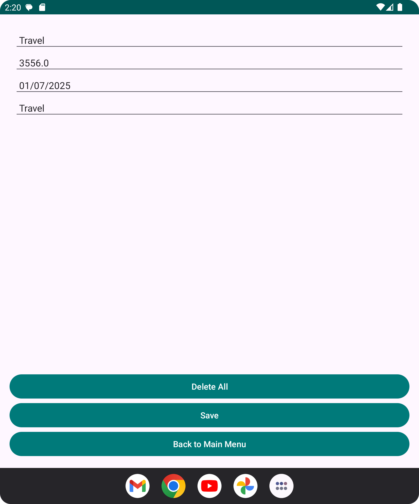
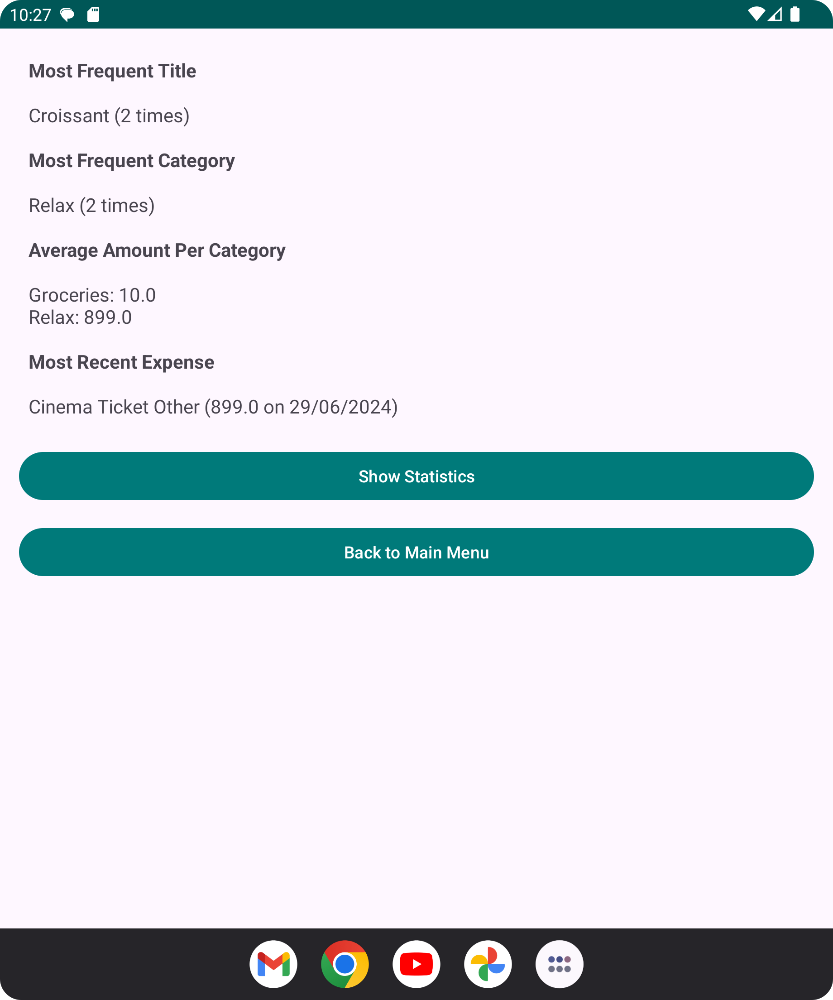

# Budget Tracker Android App
This is a simple budget tracker app for `Android` for the purpose of Mobile Computing Course at 
Birkbeck University of London. 
***
## Features
- Add expenses with details such as title, amount, date, and category.
- Edit existing expenses.
- View all expenses.
- View statistics on expenses, such as the most frequent category and total spending.
***
# Instructions for Using the app 
### Test the App 
- Run the Classes `ApplicationTestInstrumented` and `ExpenseDAOTest` to test the app functionality.
***
### Once Tests finish go to the app and execute main app on your virtual device on Android Studio
- Add expenses with details such as title, amount, date, and category.
- Then check the menu show expenses to see the expenses you have added.
- Then you can edit the expenses you have added.
- You can also view statistics on expenses, such as the most frequent category and total spending.
***
## App Menu
This is the main view of the App with two main menu options modalities:

- 1.Menu Options on top left corner
- 2.Menu Options on center of app
***
- Add Expenses on List : Here user can add expenses one by one.

***
- Show Expenses on List : Here user can view all the expenses added.

***
- Edit Expenses on List : Here user will edit the expenses.
- A user can edit any element of the expense.
- To erase the expense , user needs to <b> erase all </b> the elements of a <b> specific </b> expense.

***
- Show Statistics on List : Here user can view the statistics of all expenses added.

***

